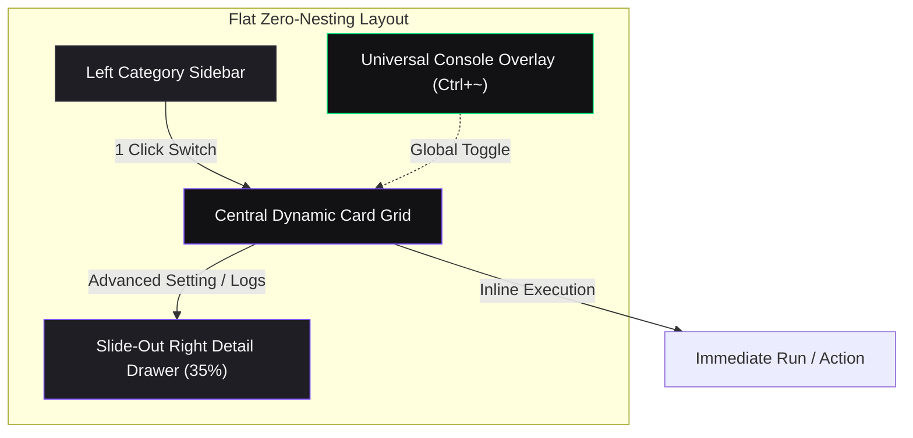
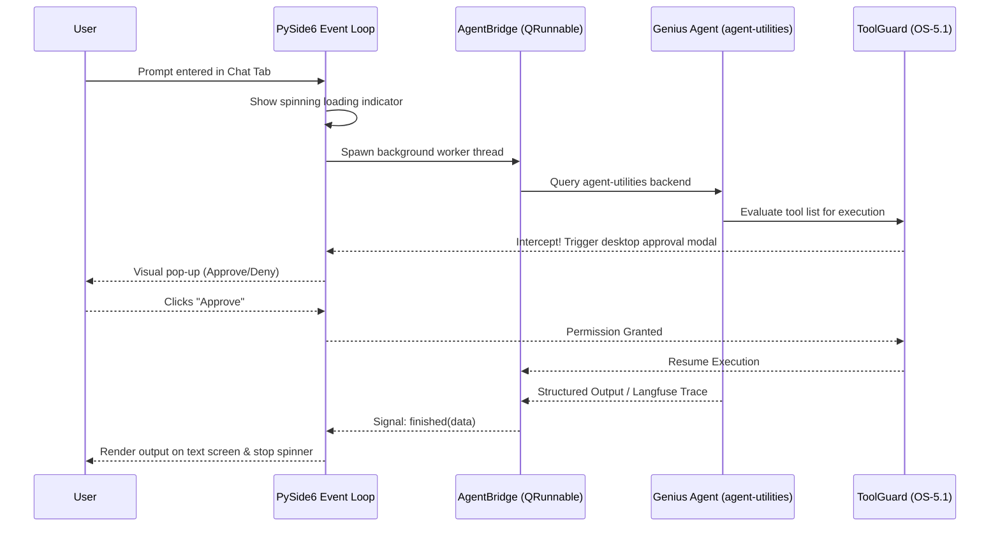

# AGENTS.md — GeniusBot Desktop Cockpit Developer Guide

> Claude Code loads this file via `CLAUDE.md` (`@AGENTS.md` import) — the two stay in sync. Edit this file, not `CLAUDE.md`.


This document defines the architecture, standard commands, code design principles, and strict safety guidelines for maintaining and extending `geniusbot`.

## 🛠️ Tech Stack & Desktop Architecture

- **Language/Version**: Python 3.11+ (aligned with ecosystem requirements `>=3.11, <3.14`)
- **UI Engine**: **PySide6** (Qt6) — Standard dynamic desktop layout, asynchronous thread dispatching.
- **Embedded Terminal**: **`xterm.js`** inside a headless **`QWebEngineView`** (Chromium core) communicating over a thread-safe **`QWebChannel`** bridge. Abstracts POSIX `pty` (Unix/macOS) and `winpty`/`conpty` (Windows) for 100% platform-independent terminal rendering.
- **Navigation Model**: **Flat Single-Pane Cockpit Layout (Zero-Nesting UX)** — 5 high-level flat categories (Dashboard, Infra, Media, Productivity, Research) populating an interactive Grid Deck of Instant Action Cards with 0-to-1 click operations.
- **Backend Powerhouse**: `agent-utilities` — CENTRALIZED orchestration, graph memory (LadybugDB/Cypher), and tool guard policies.
- **Agent Server Link**: Direct IPC and native binding to the `genius-agent` workspace agent.

---

## 🗺️ Concept ID Registry (GeniusBot Core Pillars)

`geniusbot` uses **GBOT-6** concept identifiers to catalog and trace its desktop capabilities in our unified Knowledge Graph.

| Concept ID | Name | Focus | Core Code Paths |
| :--- | :--- | :--- | :--- |
| **AU-GBOT.cockpit.through-gbot** | **Desktop Cockpit Orchestrator** | PySide6 window loops, async `QThreadPool` dispatching, central system tray, and styling. **(Must strictly adhere to CONCEPT-HIG)** | `geniusbot/geniusbot.py` |
| **AU-GBOT.cockpit.pillar-overview** | **Ecosystem Dynamic Tab Matrix** | Scans `agent-packages/agents/*` and dynamically injects Qt control widgets for each discovered agent. | `geniusbot/plugins/` |
| **AU-GBOT.cockpit.concept-2** | **Embedded Terminal Sandbox** | PTY process execution streaming `agent-terminal-ui` inside a custom text widget. | `geniusbot/qt/terminal_widget.py` |
| **AU-GBOT.cockpit.concept-3** | **Universal Tool Approval Gate** | Desktop modal prompt that intercepts critical commands triggered by backend agents. **(Must use glassmorphic depth/CONCEPT-HIG)** | `geniusbot/qt/tool_guard.py` |
| **AU-GBOT.cockpit.concept-4** | **Topological Cockpit Memory** | In-memory configuration syncing and local graph-store caching. | `geniusbot/utils/agent_bridge.py` |
| **AU-GBOT.cockpit.concept-5** | **Multi-Tenant Daemon & Tray** | Background system tray icon running scheduler loops for long-running agent tasks. | `geniusbot/utils/daemon.py` |
| **AU-GBOT.cockpit.concept-6** | **Fleet Supervisory Cockpit** | Surfaces the agent-utilities fleet autonomy control plane (AU-OS.safety.ontological-guardrail/5.15/5.24) — worker placement topology and the ActionPolicy approval inbox — via the shared gateway SDK (AU-ECO.interop.gateway-client-sdk). | `geniusbot/qt/fleet_cockpit.py` |
| **GB-GBOT.cockpit.gbot-7** | **Temporal Graph Scrubber** | Bi-temporal graph scrubber panel — replays the Knowledge Graph as-of any point in time. | `geniusbot/qt/temporal_graph_panel.py` |
| **GB-GBOT.cockpit.ask-data-nl-query** | **Ask-Data / NL→Query Cockpit** | Ask the KG a data question in plain English → auditable generated query + rows + citations, over the gateway `/api/graph/ask-data` (KG-2.308) and `/api/graph/nl-query` (KG-2.305) twins. | `geniusbot/qt/data_query_panel.py` |
| **GB-GBOT.cockpit.metrics-status-cockpit** | **Engine Metrics & Status Cockpit** | PromQL metric queries + shared content-addressed KV-cache stats over `/api/graph/promql` and `/api/graph/kvcache` (KG-2.310). | `geniusbot/qt/metrics_panel.py` |
| **GB-GBOT.cockpit.federated-search-cockpit** | **Federated Search Cockpit** | One query fanned across every registered external graph over `/api/graph/federated-search` (KG-2.310). | `geniusbot/qt/federated_search_panel.py` |
| **GB-GBOT.cockpit.voice-dictation-cockpit** | **Voice Dictation Cockpit** | Desktop mic capture (QtMultimedia) transcribed through the SAME governed audio-transcriber-mcp sidecar the webui's dictation control uses, over `POST /api/enhanced/voice/transcribe` (backend AU-ECO.mcp.webui-voice-transcription-delegation). Honest states: no device, recorder/permission failure, backend unavailable, and a genuine error are each shown distinctly. TTS/playback not implemented (no backend route). | `geniusbot/qt/voice_panel.py` |

> **Note on UI Cohesion (`CONCEPT-HIG`)**: All PySide6 UI elements implemented under AU-GBOT.cockpit.through-gbot and AU-GBOT.cockpit.concept-3 must adhere to the ecosystem-wide **Human Interface Guidelines**. This includes supporting dynamic QPalette/stylesheet brand theming, rail-navigation sidebars (via QPropertyAnimation), and depth-aware/glassmorphic modals for disruptive prompts.

---

## 🏗️ Architectural Visualizations

### Flat Zero-Nesting Layout


### Desktop Container Architecture
```mermaid
graph TD
    subgraph UI ["GeniusBot UI Layer (PySide6)"]
        MainWindow["QMainWindow (Host Window)"]
        TabWidget["QTabWidget (Dynamic Tabs)"]
        TerminalPanel["TerminalPanel (xterm.js / QWebEngineView)"]
        SettingsTab["Settings (XDG Config)"]
    end

    subgraph Core ["Core Orchestration Backend"]
        AgentUtilities["agent-utilities (Backend Engine)"]
        AgentFactory["AgentFactory (Dynamic Routing)"]
        KG["Epistemic Knowledge Graph (LadybugDB)"]
    end

    subgraph Agents ["Agent Packages"]
        GeniusAgent["genius-agent (Reasoning Hub)"]
        OtherAgents["Ecosystem Agents (Media, Systems, etc.)"]
        TerminalUI["agent-terminal-ui (Textual App)"]
    end

    MainWindow --> TabWidget
    TabWidget --> TerminalPanel
    TabWidget --> SettingsTab

    MainWindow --> AgentUtilities
    AgentUtilities --> AgentFactory
    AgentFactory --> KG

    TerminalPanel -.-->|QWebChannel Bridge| TerminalUI
    AgentFactory -->|Native Import / IPC| GeniusAgent
    AgentFactory -->|Native / MCP| OtherAgents

    style MainWindow fill:#A6E3A1,stroke:#94E2D5,stroke-width:2px,color:#11111B
    style TabWidget fill:#A6E3A1,stroke:#94E2D5,stroke-width:2px,color:#11111B
    style TerminalPanel fill:#A6E3A1,stroke:#94E2D5,stroke-width:2px,color:#11111B
    style SettingsTab fill:#A6E3A1,stroke:#94E2D5,stroke-width:2px,color:#11111B
    style AgentUtilities fill:#89B4FA,stroke:#B4BEFE,stroke-width:2px,color:#11111B
    style AgentFactory fill:#89B4FA,stroke:#B4BEFE,stroke-width:2px,color:#11111B
    style KG fill:#89B4FA,stroke:#B4BEFE,stroke-width:2px,color:#11111B
    style GeniusAgent fill:#F38BA8,stroke:#F5E0DC,stroke-width:2px,color:#11111B
    style OtherAgents fill:#F38BA8,stroke:#F5E0DC,stroke-width:2px,color:#11111B
    style TerminalUI fill:#F38BA8,stroke:#F5E0DC,stroke-width:2px,color:#11111B
```

### Async Agent Query & UI Feedback Flow


---

## 💻 Developer Commands

### Modern Installation (via uv)
To spin up the development environment:
```bash
uv sync --all-extras
```

### Execution
Run the modern PySide6 cockpit:
```bash
uv run geniusbot
```

### Quality & Standards Enforcement
Run Ruff linting and formatting scans before committing code:
```bash
# Lint check
uv run ruff check . --fix

# Format code
uv run ruff format .
```

### Packaging & Executable Compilation
Compile the standalone executable for desktop distribution:
```bash
uv run pyinstaller --clean geniusbot.spec
```

---

## 📂 Project Structure

To align with modern packaging standards, the modernized repository should follow the layout below:

```text
geniusbot/
├── .github/
│   └── workflows/
│       └── pipeline.yml         # Standard CI pipeline
├── docs/
│   ├── index.md                 # Home page for documentation
│   └── pillars/
│       └── desktop_cockpit.md   # GBOT-6 Architecture Deep-Dive
├── geniusbot/
│   ├── __init__.py
│   ├── __main__.py
│   ├── geniusbot.py             # PySide6 application bootloader
│   ├── img/
│   │   ├── geniusbot.ico
│   │   └── geniusbot.png
│   ├── qt/                      # 13 modules (4 are cockpits/dashboards, marked ★)
│   │   ├── __init__.py          # Public re-exports for the qt package
│   │   ├── colors.py            # AUTO-GENERATED color tokens + DARK_COCKPIT_STYLE QSS
│   │   │                        #   (regenerate via `python3 ../design-system/gen_qss.py`)
│   │   ├── finance_cockpit.py   # ★ Cockpit: live financial charts (candlestick/area/scatter)
│   │   ├── graph_explorer.py    # Cypher query panel for the Epistemic Graph
│   │   ├── infra_cockpit.py     # ★ Cockpit: host load, containers, SSH networks
│   │   ├── scrollable_widget.py # ScrollLabel — reusable scrollable label widget
│   │   ├── security_policy.py   # Zero-Trust authorization / permission strictness panel
│   │   ├── service_dashboard.py # ★ Dashboard: Homepage-style service management
│   │   ├── telemetry_dashboard.py # ★ Dashboard: latencies, success rates, Logfire traces
│   │   ├── terminal_widget.py   # Monospace shell rendering / PTY bridge via xterm.js
│   │   ├── tool_guard.py        # Interactive tool approval dialog (glassmorphic)
│   │   ├── widget_mapper.py     # Dynamic per-agent control panel generator
│   │   └── workflow_builder.py  # Sequential specialist workflows + agent-debate viewer
│   └── utils/
│       ├── __init__.py
│       ├── agent_bridge.py      # Thread-safe agent worker
│       └── daemon.py            # System tray daemon controller
├── tests/
│   ├── conftest.py
│   ├── test_ui_bootstrap.py     # PyQt6/PySide6 window tests
│   └── test_terminal_pty.py     # POSIX terminal harness tests
├── pyproject.toml               # Hatchling PEP-517 configuration
├── geniusbot.spec               # Modern PyInstaller build spec
├── AGENTS.md                    # Developer guidelines (This file)
├── LICENSE                      # MIT license
└── README.md                    # Public user documentation
```

---

## 🛡️ Code Conventions & Safety Boundaries

### Thread Safety (Mandatory Rule)
**NEVER make blocking network calls or run heavy agent reasoning tasks directly in the main GUI thread.**
* Doing so blocks the PySide6 event loop, causing the OS to mark the application window as "Not Responding" and freeze.
* Always use `QThread`, `QThreadPool`, or `QRunnable` combined with Qt Signals/Slots to update UI components from background threads.

**Incorrect Blocking Code:**
```python
# AVOID: synchronous call freezes the window
def handle_chat(self):
    prompt = self.chat_input.text()
    response = self.agent.run_sync(prompt)  # Synchronous backend call (FREEZES UI)
    self.chat_display.append(response.data)
```

**Correct Asynchronous Qt Pattern:**
```python
from PySide6.QtCore import QRunnable, Slot, pyqtSignal

class AgentWorker(QRunnable):
    class WorkerSignals(QObject):
        finished = pyqtSignal(str)
        error = pyqtSignal(str)

    def __init__(self, prompt):
        super().__init__()
        self.prompt = prompt
        self.signals = self.WorkerSignals()

    @Slot()
    def run(self):
        try:
            # Execute backend work safely in the background pool
            response = agent.run_sync(self.prompt)
            self.signals.finished.emit(response.data)
        except Exception as e:
            self.signals.error.emit(str(e))
```

### Safety and Guardrails
* **XDG Centralized Configuration**: centralize user credentials, local keys, and safety settings inside `~/.config/agent-utilities/config.json`. **NEVER** save credentials in plain files inside the `geniusbot` directory.
* **Sensitive Pattern Interception**: All plugins must register tool execution pipelines through `agent-utilities`' `ToolGuard` system to guarantee full compliance with local security policies.

## ⛔ No Scratch or Temporary Files in Repository

**NEVER write any of the following to this repository:**
- Temporary test scripts (e.g. scripts starting with 'test_' or 'debug_' outside of the 'tests/' directory)
- Scratch scripts or experimental one-off files
- Log files (`.log`, `.txt` command output)
- Random text files with command output or debug dumps
- Any file that is NOT production source code, tests in `tests/`, or documentation

**Why:** These files expose private filesystem paths, credentials, and internal infrastructure details when pushed to GitHub publicly.

**Where to put scratch work instead:**
- Use `~/workspace/scratch/` for temporary scripts and experiments
- Use `~/workspace/reports/` for command output and reports
- Keep test scripts in the `tests/` directory following proper pytest conventions


## ⛔ Keep the Repository Root Pristine

The repository root must contain only canonical project files. The only hidden
directories allowed at root are `.git/`, `.github/`, `.specify/` (plus a local,
git-ignored `.venv/`). NEVER write scratch/debug/migration files to the repo —
especially the root: no `fix_*.py`/`migrate_*.py`/`refactor_*.py`/root `test_*.py`,
no `*.db`/`*.log`/scratch `*.txt`/`*.orig`/`*.rej`/`*.bak`, no build artifacts
(`*.tsbuildinfo`), and no AI scratch dirs (`.agent/`, `.agents/`, `.agent_data/`,
`.tmp/`, `.hypothesis/`). Put experiments in `~/workspace/scratch/`, tests in
`tests/`. Run `git status` before finishing and confirm no stray root files.

## Working Discipline — think, simplify, stay surgical, verify

These four habits cut the most common LLM coding mistakes. For trivial tasks, use
judgment; the bias here is correctness over speed.

- **Think before coding.** State your assumptions explicitly. If a request has more than
  one reasonable reading, surface the options instead of silently picking one. If a
  simpler approach exists, say so and push back when warranted. When something is
  genuinely unclear, stop and name what's confusing — ask, don't guess.
- **Simplicity first.** Write the minimum code that solves the stated problem — no
  speculative features, no abstraction for single-use code, no configurability that
  wasn't requested, no error handling for impossible states. If you wrote 200 lines and
  it could be 50, rewrite it. (Name code from its purpose, never `wave0`/`phase2`/`v2`.)
- **Stay surgical.** Every changed line should trace directly to the task. Don't refactor,
  reformat, or "improve" working code adjacent to your change; match the existing style
  even where you'd do it differently. Remove only the imports/symbols your own change
  orphaned; if you spot unrelated dead code, mention it rather than deleting it inline.
  *Exception — the Quality Bar below:* lint/format/type errors the pre-commit gate flags
  get fixed regardless of who introduced them. In short: **surgical on behavior, clean on
  lint.**
- **Verify against a goal.** Turn the task into a checkable outcome before you start:
  "fix the bug" → "write a failing test that reproduces it, then make it pass"; "add
  validation" → "tests for the invalid inputs pass". For multi-step work, state the short
  plan and the check for each step, then loop until the checks pass.

## Quality Bar — Leave the Codebase Clean (REQUIRED)

After completing any code change, run the project's pre-commit suite and drive it
**fully green** before committing:

```bash
pre-commit run --all-files
```

Resolve **every** issue it reports — failures, lint errors, type errors, and
warnings — **including problems that pre-date your change and were not caused by
your edits**. The standing goal is a clean, working codebase with **no errors and
no warnings**. Do not silence checks (`# noqa`, `# type: ignore`, `SKIP=`,
`--no-verify`) to force green unless the exception is already documented in this
file as a known, unavoidable limitation. Only commit once `pre-commit run
--all-files` passes cleanly; if a check legitimately cannot pass, stop and explain
why rather than bypassing it.

## Working with Git Worktrees (multi-session)

Multiple agents/sessions work the `agent-packages/*` repos concurrently. **Do not
edit the canonical checkout** (`${WORKSPACE_ROOT}/agent-packages/<repo>`) — a
background `repository-manager` sync can reset its working tree and discard
uncommitted edits. Take your own git worktree on your own branch instead:

```bash
# preferred — repository-manager MCP:
rm_worktree add <repo> <your-branch>      # -> ${WORKTREE_ROOT}/<repo>/<your-branch>

# raw-git fallback:
git -C agent-packages/<repo> checkout main
git -C agent-packages/<repo> worktree add ${WORKTREE_ROOT}/<repo>/<branch> -b <branch>
```

Work in the worktree and **commit often** (commits survive a working-tree reset).
Each session must use a **distinct branch** — git allows a branch in only one
worktree, which is what keeps concurrent sessions from colliding. Worktrees live
under `${WORKTREE_ROOT}/` (outside the workspace scan, so the sync leaves them
alone).

**Finishing work in a worktree** — run this sequence before calling it done:
1. **Pre-commit green** — `pre-commit run --all-files`; resolve every issue per the
   Quality Bar above (including pre-existing), no `--no-verify`.
2. **Commit** in the worktree.
3. **Merge to main locally** — `rm_worktree merge <repo> <branch> --into main`
   (or `git merge --no-ff`). Push only when the user asks.
4. **Clean up** — remove the worktree and delete the merged branch:
   `rm_worktree remove <repo> <branch> --delete-branch`; `rm_worktree prune` clears
   stale entries. (Raw-git: `git worktree remove <path> && git branch -d <branch>`.)

## Version & lockfile drift edict (keep the version mirrors AND every generated lock artifact in sync)

The two most common release-breakers in this fleet are **version drift** (the version in
`pyproject.toml`/`.bumpversion.cfg` advancing while `README.md`, `docker/Dockerfile`, and the
module `__version__`s lag) and a **stale generated lock artifact** (shipping known-vulnerable
transitive deps, or a dependency floor that has quietly become unsatisfiable). A version mismatch
makes the next `bump-my-version` throw `VersionNotFoundException`; a stale lock is what Dependabot
flags. "Generated lock artifact" means **every file `uv` derives from `pyproject.toml` and that a
consumer installs from** — at minimum `uv.lock` AND `requirements.txt` (a `uv pip
compile`/`uv export` output some repos ship for a plain `pip install -r requirements.txt`
consumer, is a second lockfile in every way that matters here, even though nothing
text-registers it in `.bumpversion.cfg`) — plus any other such artifact a repo adds later. Naming
`uv.lock` only, as this edict once did, is how this repo's own `requirements.txt` shipped pinning
an unpublishable `agent-utilities==1.0.0` (a full major version stale) with nothing catching it
(C2) — see `scripts/check_lockfile_version_mirrors.py`'s `check-lockfile-version-mirrors`
pre-commit hook, added for exactly that gap. Rules:

1. **Never hand-edit a version string.** Change the version ONLY via
   `bump-my-version bump {patch|minor|major}` (a.k.a. `bump2version`), which rewrites every file
   registered in `.bumpversion.cfg` in one atomic, tagged commit. If you edited the version in
   `pyproject.toml` by hand, you created drift — revert and use the bumper.
2. **Every version-bearing file must be registered in `.bumpversion.cfg`** — at minimum
   `pyproject.toml` AND `README.md`, plus `docker/Dockerfile` and any module `__version__`. Never
   add a file that embeds the version without a `[bumpversion:file:...]` entry for it.
3. **Re-lock on every dependency change, in EVERY generated lock artifact.** After editing
   `pyproject.toml` deps/extras, run `uv lock` and commit `uv.lock` in the SAME change, and
   regenerate `requirements.txt` the same way in the same change. The
   `check-lockfile-version-mirrors` pre-commit hook fails when either artifact disagrees with
   `pyproject.toml` — never bypass it. The committed lock artifacts are the Dependabot/security
   surface.
4. **Patch CVEs with a version floor at the source, then re-lock.** `uv` resolves one version
   graph-wide, so a lower-bound in the extra that pulls a dependency raises it for the whole lock
   — and for every generated lock artifact derived from it.

### Known, unavoidable limitation — `agent-utilities` resolves via a local sibling checkout, not the index (D-FE-1)

`agent-utilities>=2.0.0` (declared in `[project.dependencies]`) is **not yet published** to the
index this project otherwise resolves against (only `<=1.26.4` is there), so `pyproject.toml`
carries `[tool.uv.sources] agent-utilities = { path = ".uv-workspace-siblings/agent-utilities",
editable = true }` — the agent-webui BUG-074 pattern (superseding an earlier `{ workspace = true }`
attempt this section used to document; `{ workspace = true }` never actually worked for a
standalone-clonable repo like this one, since it requires the ambient ecosystem monorepo to be
present at all) — to satisfy it from the co-versioned sibling checkout
(`agent-packages/agent-utilities`) via a local, untracked, gitignored symlink instead.

Two consequences follow:

- **`uv lock`/`uv sync`/`pytest` all resolve correctly from an isolated `git worktree` now** (this
  is *not* a limitation, unlike the old `{ workspace = true }` mechanism) — a plain PATH dependency
  has no workspace-membership requirement, so it works identically whether the checkout is
  canonical or a worktree, and whether or not the ambient `${WORKSPACE_ROOT}` ecosystem
  workspace is even present. The only remaining requirement is materializing
  `.uv-workspace-siblings/agent-utilities` (a symlink to the sibling checkout) once per checkout —
  see `.gitignore`'s matching entry. (Running `uv lock` from this repo's canonical, *ecosystem*-nested
  location, as opposed to an isolated worktree, can still fail with a `Nested workspaces are not
  supported` error — that is a separate, pre-existing fact about `${WORKSPACE_ROOT}`'s own
  layout (agent-utilities is itself a nested workspace root there), not something this repo's own
  `pyproject.toml` can fix; it is exactly why this program's standing convention is to do all work
  from a `git worktree add` outside `${WORKSPACE_ROOT}` in the first place.)
- **A fully re-locked, portable `requirements.txt` (pinned versions resolvable by plain `pip`, no
  local paths) is still blocked on the same external fact** — the original `uv pip compile
  --no-sources pyproject.toml` invocation deliberately ignores `[tool.uv.sources]` so the output
  represents what a consumer *without* the sibling checkout would resolve, and that consumer still
  hits the unpublished `agent-utilities>=2.0.0` floor. `uv export` against the local, `{path=...}`-resolved
  lock instead is possible today, but produces `-e ./.uv-workspace-siblings/agent-utilities` entries
  that are not portable outside this exact checkout layout — a change in the file's semantics, not
  a fix, so it is intentionally NOT what `check-lockfile-version-mirrors` regenerates automatically.
  `requirements.txt` stays pinned at the last version the index actually offered until
  `agent-utilities` 2.x is published, at which point a plain `uv pip compile --no-sources
  pyproject.toml -o requirements.txt` will pick up the published floor directly.
