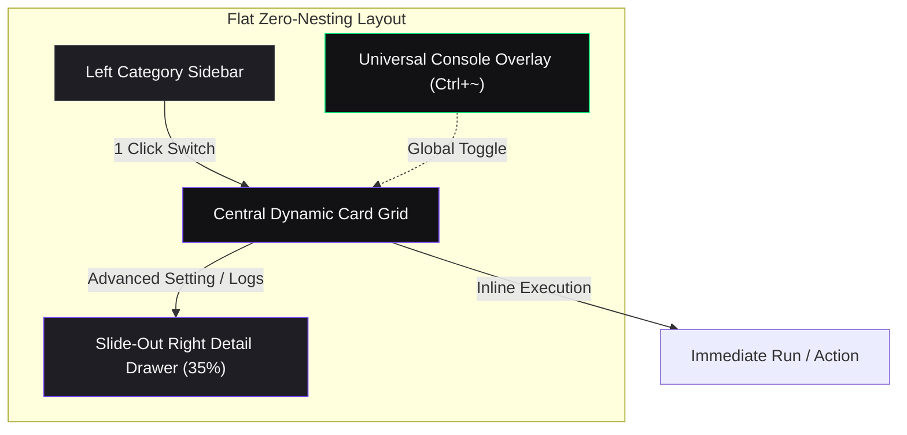
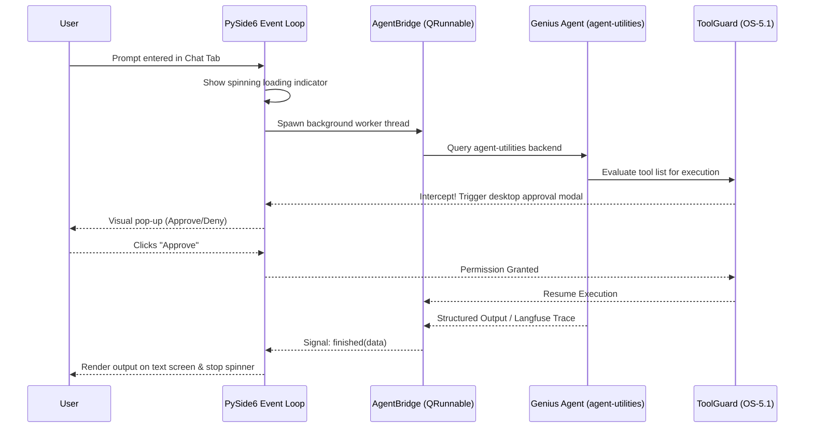

# AGENTS.md — GeniusBot Desktop Cockpit Developer Guide

This document defines the architecture, standard commands, code design principles, and strict safety guidelines for maintaining and extending `geniusbot`.

## 🛠️ Tech Stack & Desktop Architecture

- **Language/Version**: Python 3.11+ (aligned with ecosystem requirements `>=3.11, <3.14`)
- **UI Engine**: **PySide6** (Qt6) — Standard dynamic desktop layout, asynchronous thread dispatching.
- **Embedded Terminal**: **`xterm.js`** inside a headless **`QWebEngineView`** (Chromium core) communicating over a thread-safe **`QWebChannel`** bridge. Abstracts POSIX `pty` (Unix/macOS) and `winpty`/`conpty` (Windows) for 100% platform-independent terminal rendering.
- **Navigation Model**: **Flat Single-Pane Cockpit Layout (Zero-Nesting UX)** — 5 high-level flat categories (Dashboard, Infra, Media, Productivity, Research) populating an interactive Grid Deck of Instant Action Cards with 0-to-1 click operations.
- **Backend Powerhouse**: `agent-utilities` — CENTRALIZED orchestration, graph memory (LadybugDB/Cypher), and tool guard policies.
- **Agent Server Link**: Direct IPC and native binding to the `genius-agent` workspace agent.

---

## 🗺️ Concept ID Registry (GeniusBot Core Pillars)

`geniusbot` uses **GBOT-6** concept identifiers to catalog and trace its desktop capabilities in our unified Knowledge Graph.

| Concept ID | Name | Focus | Core Code Paths |
| :--- | :--- | :--- | :--- |
| **GBOT-6.0** | **Desktop Cockpit Orchestrator** | PySide6 window loops, async `QThreadPool` dispatching, central system tray, and styling. | `geniusbot/geniusbot.py` |
| **GBOT-6.1** | **Ecosystem Dynamic Tab Matrix** | Scans `agent-packages/agents/*` and dynamically injects Qt control widgets for each discovered agent. | `geniusbot/plugins/` |
| **GBOT-6.2** | **Embedded Terminal Sandbox** | PTY process execution streaming `agent-terminal-ui` inside a custom text widget. | `geniusbot/qt/terminal_widget.py` |
| **GBOT-6.3** | **Universal Tool Approval Gate** | Desktop modal prompt that intercepts critical commands triggered by backend agents. | `geniusbot/qt/tool_guard.py` |
| **GBOT-6.4** | **Topological Cockpit Memory** | In-memory configuration syncing and local graph-store caching. | `geniusbot/utils/agent_bridge.py` |
| **GBOT-6.5** | **Multi-Tenant Daemon & Tray** | Background system tray icon running scheduler loops for long-running agent tasks. | `geniusbot/utils/daemon.py` |

---

## 🏗️ Architectural Visualizations

### Flat Zero-Nesting Layout


### Desktop Container Architecture
```mermaid
graph TD
    subgraph UI ["GeniusBot UI Layer (PySide6)"]
        MainWindow["QMainWindow (Host Window)"]
        TabWidget["QTabWidget (Dynamic Tabs)"]
        TerminalPanel["TerminalPanel (xterm.js / QWebEngineView)"]
        SettingsTab["Settings (XDG Config)"]
    end

    subgraph Core ["Core Orchestration Backend"]
        AgentUtilities["agent-utilities (Backend Engine)"]
        AgentFactory["AgentFactory (Dynamic Routing)"]
        KG["Epistemic Knowledge Graph (LadybugDB)"]
    end

    subgraph Agents ["Agent Packages"]
        GeniusAgent["genius-agent (Reasoning Hub)"]
        OtherAgents["Ecosystem Agents (Media, Systems, etc.)"]
        TerminalUI["agent-terminal-ui (Textual App)"]
    end

    MainWindow --> TabWidget
    TabWidget --> TerminalPanel
    TabWidget --> SettingsTab

    MainWindow --> AgentUtilities
    AgentUtilities --> AgentFactory
    AgentFactory --> KG

    TerminalPanel -.-->|QWebChannel Bridge| TerminalUI
    AgentFactory -->|Native Import / IPC| GeniusAgent
    AgentFactory -->|Native / MCP| OtherAgents

    style MainWindow fill:#A6E3A1,stroke:#94E2D5,stroke-width:2px,color:#11111B
    style TabWidget fill:#A6E3A1,stroke:#94E2D5,stroke-width:2px,color:#11111B
    style TerminalPanel fill:#A6E3A1,stroke:#94E2D5,stroke-width:2px,color:#11111B
    style SettingsTab fill:#A6E3A1,stroke:#94E2D5,stroke-width:2px,color:#11111B
    style AgentUtilities fill:#89B4FA,stroke:#B4BEFE,stroke-width:2px,color:#11111B
    style AgentFactory fill:#89B4FA,stroke:#B4BEFE,stroke-width:2px,color:#11111B
    style KG fill:#89B4FA,stroke:#B4BEFE,stroke-width:2px,color:#11111B
    style GeniusAgent fill:#F38BA8,stroke:#F5E0DC,stroke-width:2px,color:#11111B
    style OtherAgents fill:#F38BA8,stroke:#F5E0DC,stroke-width:2px,color:#11111B
    style TerminalUI fill:#F38BA8,stroke:#F5E0DC,stroke-width:2px,color:#11111B
```

### Async Agent Query & UI Feedback Flow


---

## 💻 Developer Commands

### Modern Installation (via uv)
To spin up the development environment:
```bash
uv sync --all-extras
```

### Execution
Run the modern PySide6 cockpit:
```bash
uv run geniusbot
```

### Quality & Standards Enforcement
Run Ruff linting and formatting scans before committing code:
```bash
# Lint check
uv run ruff check . --fix

# Format code
uv run ruff format .
```

### Packaging & Executable Compilation
Compile the standalone executable for desktop distribution:
```bash
uv run pyinstaller --clean geniusbot.spec
```

---

## 📂 Targeted Directory Structure

To align with modern packaging standards, the modernized repository should follow the layout below:

```text
geniusbot/
├── .github/
│   └── workflows/
│       └── pipeline.yml         # Standard CI pipeline
├── docs/
│   ├── index.md                 # Home page for documentation
│   └── pillars/
│       └── desktop_cockpit.md   # GBOT-6 Architecture Deep-Dive
├── geniusbot/
│   ├── __init__.py
│   ├── __main__.py
│   ├── geniusbot.py             # PySide6 application bootloader
│   ├── img/
│   │   ├── geniusbot.ico
│   │   └── geniusbot.png
│   ├── qt/
│   │   ├── __init__.py
│   │   ├── colors.py            # Standard color hex constants
│   │   ├── terminal_widget.py   # Monospace shell rendering via xterm.js
│   │   └── tool_guard.py        # Interactive tool approval dialog
│   └── utils/
│       ├── __init__.py
│       ├── agent_bridge.py      # Thread-safe agent worker
│       └── daemon.py            # System tray daemon controller
├── tests/
│   ├── conftest.py
│   ├── test_ui_bootstrap.py     # PyQt6/PySide6 window tests
│   └── test_terminal_pty.py     # POSIX terminal harness tests
├── pyproject.toml               # Hatchling PEP-517 configuration
├── geniusbot.spec               # Modern PyInstaller build spec
├── AGENTS.md                    # Developer guidelines (This file)
├── LICENSE                      # MIT license
└── README.md                    # Public user documentation
```

---

## 🛡️ Code Conventions & Safety Boundaries

### Thread Safety (Mandatory Rule)
**NEVER make blocking network calls or run heavy agent reasoning tasks directly in the main GUI thread.**
* Doing so blocks the PySide6 event loop, causing the OS to mark the application window as "Not Responding" and freeze.
* Always use `QThread`, `QThreadPool`, or `QRunnable` combined with Qt Signals/Slots to update UI components from background threads.

**Incorrect Blocking Code:**
```python
# AVOID: synchronous call freezes the window
def handle_chat(self):
    prompt = self.chat_input.text()
    response = self.agent.run_sync(prompt)  # Synchronous backend call (FREEZES UI)
    self.chat_display.append(response.data)
```

**Correct Asynchronous Qt Pattern:**
```python
from PySide6.QtCore import QRunnable, Slot, pyqtSignal

class AgentWorker(QRunnable):
    class WorkerSignals(QObject):
        finished = pyqtSignal(str)
        error = pyqtSignal(str)

    def __init__(self, prompt):
        super().__init__()
        self.prompt = prompt
        self.signals = self.WorkerSignals()

    @Slot()
    def run(self):
        try:
            # Execute backend work safely in the background pool
            response = agent.run_sync(self.prompt)
            self.signals.finished.emit(response.data)
        except Exception as e:
            self.signals.error.emit(str(e))
```

### Safety and Guardrails
* **XDG Centralized Configuration**: centralize user credentials, local keys, and safety settings inside `~/.config/agent-utilities/config.json`. **NEVER** save credentials in plain files inside the `geniusbot` directory.
* **Sensitive Pattern Interception**: All plugins must register tool execution pipelines through `agent-utilities`' `ToolGuard` system to guarantee full compliance with local security policies.
