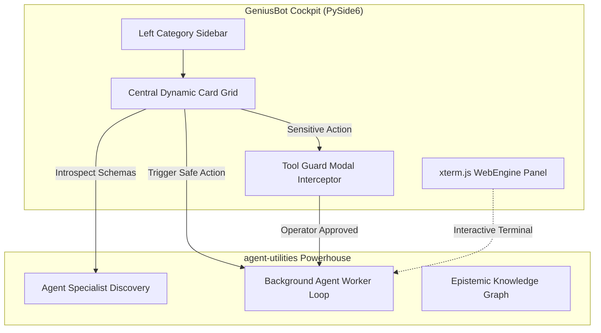

# GeniusBot — Desktop Cockpit for AI Agents


*Version: 3.45.0*

> **Documentation** — The architecture overview, security boundaries, quick-start
> guidance, and the GeniusBot concept registry are maintained in the
> [official documentation](https://knuckles-team.github.io/geniusbot/).

GeniusBot is the premium, unified space cockpit and visual control deck built on top of the `agent-utilities` powerhouse backend. It integrates all 37+ specialist agent and MCP packages from our multi-agent ecosystem into a single-pane-of-glass user interface, offering 1-click execution, embedded hybrid terminals, zero-nesting visual layouts, and a zero-trust hardware protection layer.

---

## 📖 Table of Contents
1. [Overview](#-overview)
2. [Features](#-features)
3. [Architecture](#-architecture)
4. [Installation](#-installation)
5. [Usage](#-usage)
6. [Packaging & Executables](#-packaging--executables)
7. [Documentation References](#-documentation-references)
8. [License](#-license)

---

## 🌐 Overview
GeniusBot provides a centralized graphical cockpit designed to eliminate tedious click-through fatigue. It maps specialist agent parameter schemas directly to custom QSS-themed form widgets on the fly.

Operators can trigger actions, monitor running terminal inputs via the embedded `agent-terminal-ui`, and secure dangerous CLI calls using the Zero-Trust Tool-Guard interceptor.

---

## ✨ Features

* **Zero-Nesting Dynamic UI**: Navigation categorized into flat category menus (Dashboard, Infra, Media, Productivity, Research).
* **Dynamic Card Schema Grid**: PySide6 widgets are built automatically from specialist agent tool specifications.
* **Embedded Hybrid Terminal**: Hosts local `xterm.js` to run interactive terminal loops directly in the cockpit.
* **Zero-Trust Security Tool Guard**: Prompts native authorization dialogs to review arguments before executing dangerous mutations.
* **Runnable Background Workers**: Utilizes thread pools (`QThreadPool`) to prevent GUI freezes during execution loops.
* **Visual Trading Dashboard**: Snappy native C++ charting engine (`PySide6.QtCharts`) with OHLCV candlestick/line toggles, strategy indicator overlay crossovers (MACD/RSI), orderbook bids/asks depth volumes, and thread-safe crypto news feeds.


---

## 🏛️ Architecture
GeniusBot is engineered as a lightweight PySide6 GUI client wrapper around the `agent-utilities` logic engine.



Detailed architectural diagrams and component breakdowns are located in the [Documentation Overview](docs/overview.md).

---

## 🛠️ Installation

### 1. Modern Virtual Environment (via uv)
Create a virtual environment and sync standard requirements:
```bash
# Setup virtual environment
uv venv

# Sync requirements
uv pip sync requirements.txt
```

### 2. Standard pip
Install standard stable packages:
```bash
pip install geniusbot
```

Install with all ecosystem plugins:
```bash
pip install geniusbot[all]
```

---

## 🌍 Environment Variables

GeniusBot can be configured using environment variables or a `.env` file in the project root:

| Variable | Description | Default / Example |
|----------|-------------|-------------------|
| `QT_QPA_PLATFORM` | Headless Qt Platform (set to `offscreen` for CI/CD or Docker) | `offscreen` |
| `LANGFUSE_PUBLIC_KEY` | Langfuse Observability Public Key | `pk-lf-...` |
| `LANGFUSE_SECRET_KEY` | Langfuse Observability Secret Key | `sk-lf-...` |
| `LANGFUSE_HOST` | Langfuse Host URL | `https://cloud.langfuse.com` |
| `LOGFIRE_TOKEN` | Pydantic Logfire Telemetry Token | |
| `TERM` | Terminal type for the embedded terminal emulator | `xterm-256color` |
| `_MEIPASS` / `_MEIPASS2` | PyInstaller temp directories for bundled app context | *(Used internally)* |

---

## 🚀 Usage

Launch the desktop cockpit:
```bash
uv run geniusbot
```

To run in headless or virtual Linux environments (CI/CD):
```bash
QT_QPA_PLATFORM=offscreen uv run geniusbot
```

---

## 📦 Packaging & Executables

### PyInstaller Compiling
Compiling GeniusBot as a single standalone executable:
```powershell
python -m pip install --upgrade pyinstaller
git clone https://github.com/Knuckles-Team/geniusbot.git
cd geniusbot
python -m venv .venv
./.venv/Scripts/activate
python -m pip install -r ./requirements.txt
python -m pip install -r ./build-requirements.txt
python -m pip install --upgrade pandas scipy numpy pydantic
pyinstaller --name geniusbot `
  --log-level DEBUG `
  --onefile --windowed `
  --paths "./geniusbot" `
  --icon='./geniusbot/img/geniusbot.ico' `
  --recursive-copy-metadata=opentelemetry_api `
  --recursive-copy-metadata=opentelemetry_sdk `
  --recursive-copy-metadata=opentelemetry_exporter_otlp_proto_grpc `
  --exclude-module pygame `
  --exclude-module tkinter `
   ./geniusbot/geniusbot.py
```

### Windows Setup Installer
Generate a Windows MSI setup package:
```bash
iscc "./setup.iss"
```

---

## 📚 Documentation References
For deep architectural guidelines and code documentation, explore:
* [docs/index.md](docs/index.md) — Documentation Entrypoint & Quickstart.
* [docs/overview.md](docs/overview.md) — Detailed Architecture & Security Guardrails.
* [docs/concepts.md](docs/concepts.md) — Concept Registries (`CONCEPT:GBOT-1.0` through `8.0`).

---

## 📄 License
This project is licensed under the MIT License - see the [LICENSE](LICENSE) file for details.
