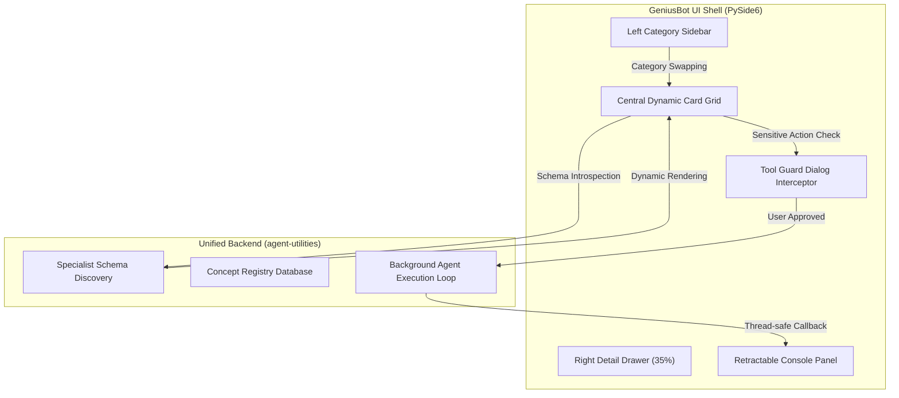

# Technical Architecture Overview

GeniusBot acts as the premium visual cockpit wrapper shell of the agent-utilities ecosystem. It connects the human operator directly with the dynamic planning models, the Epistemic Knowledge Graph, and the specialist agent toolsets.

---

## 🏛️ Application Architecture

GeniusBot is designed with a **Flat Single-Pane Layout** (Zero-Nesting UX) that splits components into focused, thread-safe spaces:

### 1. Zero-Nesting Layout
* **Left Category Sidebar**: Provides 5 flat navigation buttons: Dashboard, Infra & Network, Media & Files, Productivity, and Research & Data. Clicking a category swaps the view instantly.
* **Central Grid Deck**: Displays agents as visual cards. Tools are populated with fields that map directly to parameters using a dynamic schema mapper.
* **Right Detail Drawer**: Slides out to host long-running console output and advanced settings without causing the operator to lose active context.
* **Retractable Console Panel**: Swings from the bottom on a `Ctrl+~` key-trigger to expose the running `agent-terminal-ui` inside an embedded `QWebEngineView`.

---

## 🔒 Security boundary: Tool-Guard Interceptor

To prevent the agent from executing dangerous mutations or running destructive shell commands behind the user's back, GeniusBot implements a **Zero-Trust Tool Guard**:
1. When a tool action is triggered by the core reasoning planner, the event loop catches the command signature.
2. If the tool is flagged as sensitive (e.g. system packages, file deletion, network tunnel creation), a native modal pops up.
3. The modal highlights the JSON arguments, the exact CLI command to be run, and the risk explanation.
4. Execution is blocked until the operator clicks **"Approve Execution"**.

---

## 🧵 Thread Safety & Non-Blocking Design

To keep the UI running at a buttery-smooth 60fps without locking the interface during deep web requests or long transcribing tasks, we adhere to strict non-blocking practices:
* All specialist discovery imports are handled via background thread pools (`QThreadPool` and `QRunnable`).
* Stream logs from standard output/stderr are redirected asynchronously through thread-safe Qt Signals (`QObject` and `Signal(str)` bridges).
